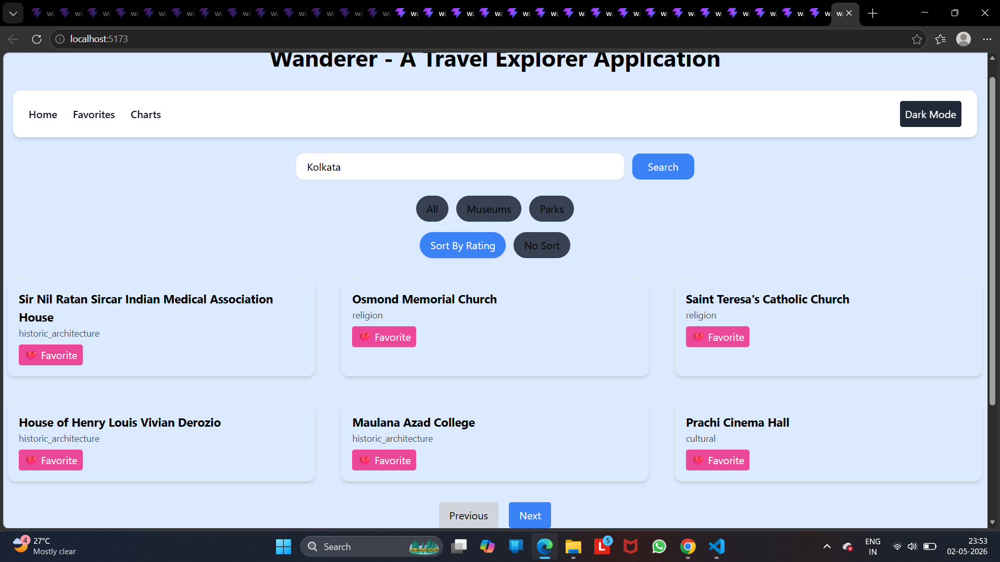
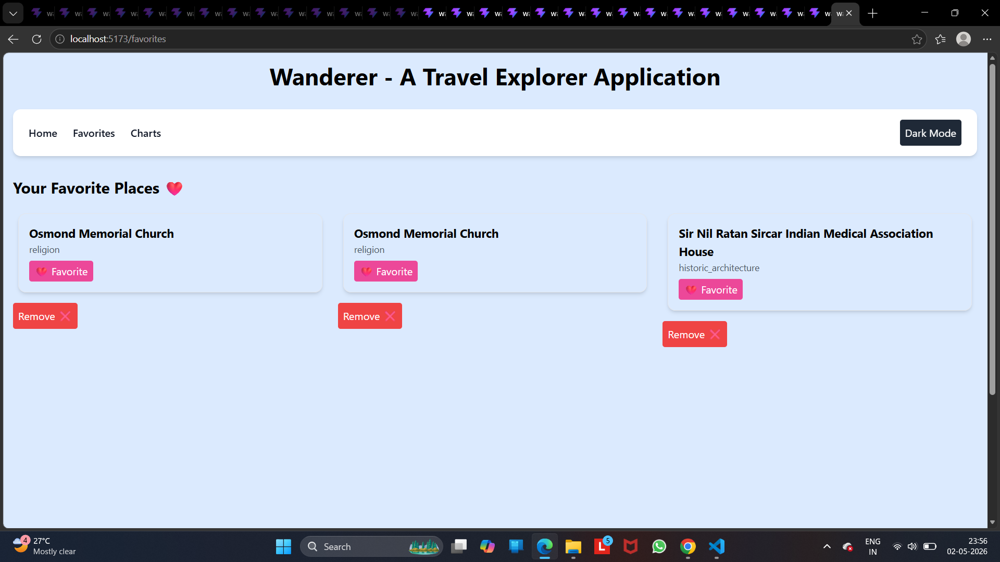

"# Wanderer---A-Travel-Explorer-SPA" 

anderer is a React-based travel discovery web app that helps users explore famous places (museums, parks, monuments, etc.) in different cities using real-time API data. It includes features like filtering, sorting, pagination, favorites, lazy loading, and theme switching.

#Project Screenshots

## Project Screenshots

## Features

Search any city and explore nearby places
Filter places (Museums, Parks, etc.)
Sort places by rating
Pagination (Next / Previous)
Add to Favorites system
Dark / Light mode toggle
Lazy loading for performance optimization
Loading & error handling UI
API integration using OpenTripMap (RapidAPI)
Fallback UI using sample data

##  Tech Stack

React (Vite)
JavaScript (ES6+)
Context API (State Management)
React Router DOM
Tailwind CSS
Fetch API
OpenTripMap API (RapidAPI)
